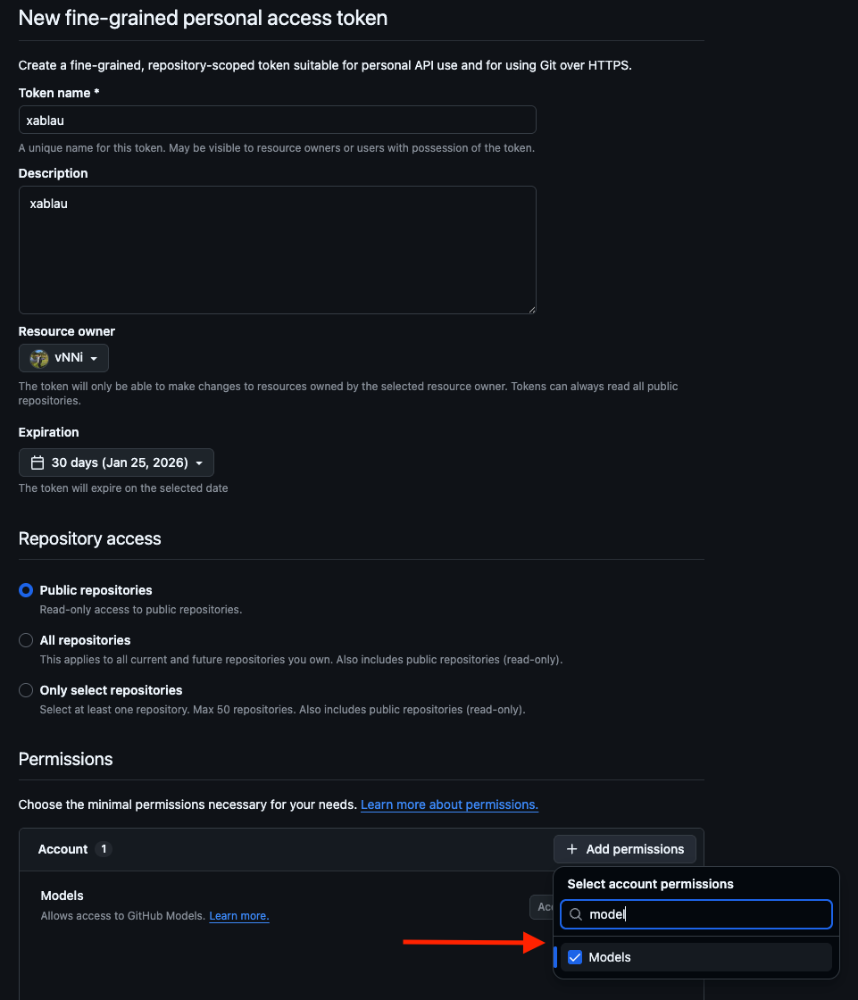
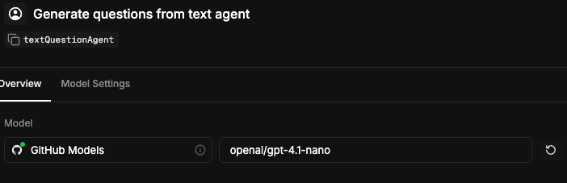

# Nutria Backend

Backend para o sistema Nutria, construído com Node.js e TypeScript.

## Requisitos

- Node.js 25.2.1 (versão especificada no [.nvmrc](.nvmrc))

## Setup

### Opção 1: Usando nvm

1. **Instale o nvm** (se ainda não tiver):

   ```bash
   curl -o- https://raw.githubusercontent.com/nvm-sh/nvm/v0.39.7/install.sh | bash
   ```

2. **Reinicie o terminal e instale a versão do Node.js**:

   ```bash
   nvm install 25.2.1
   nvm use 25.2.1
   ```

   Ou simplesmente use o comando que lê automaticamente o [.nvmrc](.nvmrc):

   ```bash
   nvm install
   nvm use
   ```

### Opção 2: Usando asdf (Recomendado)

1. **Instale o asdf** (se ainda não tiver):

   ```bash
   # macOS com Homebrew
   brew install asdf

   # Linux (Debian/Ubuntu)
   git clone https://github.com/asdf-vm/asdf.git ~/.asdf --branch v0.14.0
   ```

2. **Configure o asdf no seu shell**:

   ```bash
   # Para zsh
   echo -e '\n. "$HOME/.asdf/asdf.sh"' >> ~/.zshrc
   echo -e '\n. "$HOME/.asdf/completions/asdf.bash"' >> ~/.zshrc
   ```

3. **Reinicie o terminal e instale o plugin Node.js**:

   ```bash
   asdf plugin add nodejs
   ```

4. **Instale a versão do Node.js especificada**:

   ```bash
   asdf install nodejs 25.2.1
   asdf global nodejs 25.2.1
   ```

### Instalação das Dependências

```bash
pnpm install
```

## Configuração

1. **Copie o arquivo de exemplo de variáveis de ambiente**:

   ```bash
   cp .env.example .env
   ```

2. **Configure as variáveis de ambiente necessárias no arquivo [.env](.env)**

## Integrando com LLM Providers

### GitHub Models

Para usar os modelos de LLM fornecidos pelo GitHub, siga os passos abaixo:

1. **Acesse a página de tokens do GitHub**:

   [https://github.com/settings/personal-access-tokens](https://github.com/settings/personal-access-tokens)

2. **Crie um novo token** com as seguintes configurações:
   - Clique em "Generate new token" (Fine-grained tokens)
   - Dê um nome descritivo ao token (ex: "Nutria Backend LLM Access")
   - Defina a expiração conforme sua necessidade
   - Em "Permissions", adicione a permissão **"Models"** com acesso de leitura

   


3. **Adicione o token ao arquivo [.env](.env)**:

   ```env
   GITHUB_TOKEN=seu-token-gerado-no-passo-anterior
   ```

## Executando o Projeto

```bash
# Desenvolvimento
pnpm dev

# Build
pnpm build

# Produção
pnpm start
```

## Locally development

Dentro do mastra studio: http://localhost:4111/, temos vários agents. Esse mastra studio existe só para desenvolvimento, nosso front-end real irá chamar a API do mastra - que por curiosidade usa Hono JS.

Um `agent` é como um micro serviço dentro do seu sistema (inúmeros micro serviços), eles podem ser usados e testados individualmente.

Para conseguir conversar com uma LLM real, use a configuração do GitHub Models (conforme feito anteriormente no setup do token).



> **OBS** tente usar sempre um modelo "nano", "mini" para consumir menos tokens em desenvolvimento :)

### Agent disponível (MVP):
- `nutritionAnalystAgent` - Analista nutricional com busca de alimentos e cálculos

## Documentação Adicional

- Esse projeto foi criado usando o template do mastra.ai chamado "chat with pdf": https://mastra.ai/templates/pdf-questions
- Template original preservado em [README-OLD.md](README-OLD.md) para referência
