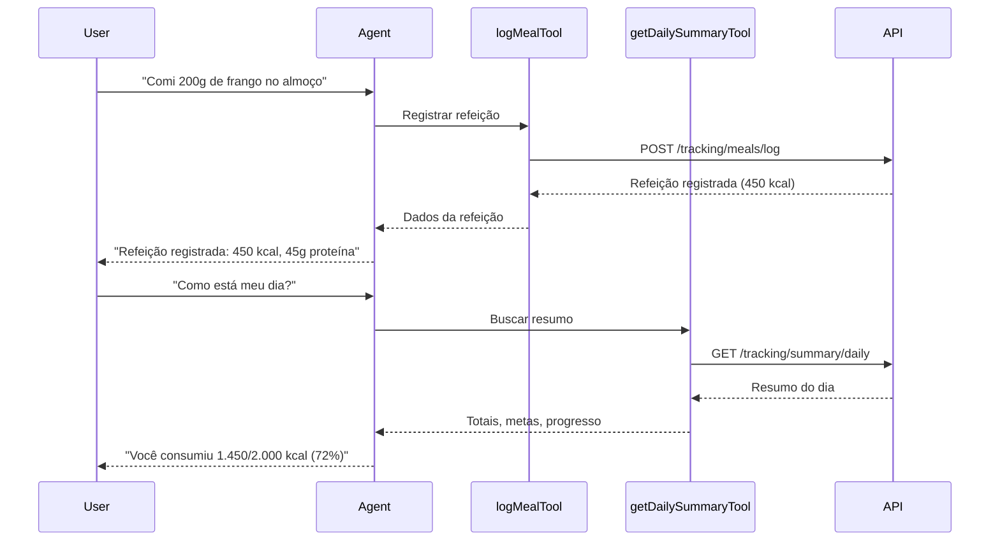

# Sistema de Rastreamento - Integração com Agent Backend

## 📋 Visão Geral

Este documento descreve a integração completa do **Sistema de Rastreamento e Histórico de Refeições** com o backend Agent (Mastra.ai). O sistema permite que o agente de IA registre refeições, acompanhe o progresso nutricional diário e forneça estatísticas semanais aos usuários.

## ✅ O que foi Implementado

### 1. Cliente do Catálogo (`src/mastra/clients/catalog-client.ts`)

Três novas funções foram adicionadas ao cliente que consome a API nutria-catalog:

#### **logMeal()**
```typescript
export const logMeal = async (
  request: LogMealRequest,
  config = defaultConfig,
): Promise<MealLogResponse>
```
- Registra uma refeição consumida pelo usuário
- Calcula automaticamente os totais nutricionais
- Atualiza as estatísticas diárias

**Parâmetros:**
- `user_id`: UUID do usuário
- `meal_type`: "breakfast" | "lunch" | "dinner" | "snack"
- `foods`: Array de alimentos com `food_id` e `quantity_g`
- `consumed_at` (opcional): Data/hora da refeição
- `notes` (opcional): Anotações sobre a refeição

**Retorna:**
- ID da refeição registrada
- Totais nutricionais (calorias, proteínas, carboidratos, gorduras)
- Número de alimentos
- Tipo de refeição

#### **getDailySummary()**
```typescript
export const getDailySummary = async (
  userId: string,
  date?: string,
  config = defaultConfig,
): Promise<DailySummaryResponse>
```
- Obtém o resumo nutricional completo do dia
- Retorna todas as refeições, totais, metas e progresso

**Parâmetros:**
- `userId`: UUID do usuário
- `date` (opcional): Data no formato YYYY-MM-DD (padrão: hoje)

**Retorna:**
- Data do resumo
- Número de refeições
- Totais consumidos (calorias, macros)
- Metas nutricionais
- Progresso em percentuais
- Lista detalhada de refeições

#### **getWeeklyStats()**
```typescript
export const getWeeklyStats = async (
  userId: string,
  days = 7,
  config = defaultConfig,
): Promise<WeeklyStatsResponse>
```
- Obtém estatísticas semanais de consumo nutricional

**Parâmetros:**
- `userId`: UUID do usuário
- `days` (opcional): Número de dias (padrão: 7)

**Retorna:**
- Estatísticas diárias
- Médias de calorias e macronutrientes
- Taxa de aderência às metas
- Total de refeições registradas

---

### 2. Ferramentas Mastra.ai (Tools)

Três novas ferramentas foram criadas para que o agente possa usar as funções do cliente:

#### **logMealTool** (`src/mastra/tools/log-meal.ts`)
- **ID**: `log_meal`
- **Descrição**: Registra refeições consumidas com cálculo automático de nutrientes
- **Quando usar**: Quando o usuário mencionar que comeu/consumiu algo
- **Exemplos**: "Comi 2 ovos no café", "Registrar almoço com arroz e feijão"

#### **getDailySummaryTool** (`src/mastra/tools/get-daily-summary.ts`)
- **ID**: `get_daily_summary`
- **Descrição**: Obtém resumo nutricional do dia com totais, metas e progresso
- **Quando usar**: Quando o usuário perguntar sobre o dia ou progresso
- **Exemplos**: "Como está meu dia?", "Estou dentro das metas?", "Quantas calorias já consumi?"

#### **getWeeklyStatsTool** (`src/mastra/tools/get-weekly-stats.ts`)
- **ID**: `get_weekly_stats`
- **Descrição**: Obtém estatísticas semanais com médias e taxa de aderência
- **Quando usar**: Quando o usuário perguntar sobre a semana ou consistência
- **Exemplos**: "Como foi minha semana?", "Estou sendo consistente?", "Média semanal"

---

### 3. Agente Nutrition Analyst (`src/mastra/agents/nutrition-analyst.ts`)

O agente foi atualizado com:

✅ **Novas Responsabilidades:**
- Registrar refeições consumidas e acompanhar progresso diário/semanal
- Monitorar aderência às metas nutricionais

✅ **Novas Ferramentas Registradas:**
```typescript
tools: [
  searchFoodCatalogTool,
  calculateNutritionTool,
  findSimilarFoodsTool,
  recommendationTool,
  logMealTool,           // ✨ NOVO
  getDailySummaryTool,   // ✨ NOVO
  getWeeklyStatsTool,    // ✨ NOVO
]
```

✅ **Instruções Expandidas:**
- Documentação completa de quando usar cada ferramenta
- Exemplos de uso para cada tool
- Padrões de resposta para o usuário

---

## 🧪 Como Testar

### Opção 1: Mastra Studio (Recomendado)

1. **Iniciar o servidor**:
```bash
cd nutria-backend
npm run dev
```

2. **Acessar o Mastra Studio**:
   - Abra http://localhost:4111/
   - Selecione o agente `nutrition-analyst`

3. **Testar cada ferramenta**:

**Teste 1: Registrar Refeição**
```
Usuário: Comi 150g de peito de frango e 100g de arroz integral no almoço
```
Comportamento esperado:
- Agente busca os alimentos (searchFoodCatalogTool)
- Agente registra a refeição (logMealTool)
- Agente apresenta resumo nutricional

**Teste 2: Ver Resumo do Dia**
```
Usuário: Como está meu dia hoje?
```
Comportamento esperado:
- Agente busca o resumo diário (getDailySummaryTool)
- Agente apresenta totais, metas e progresso em %

**Teste 3: Ver Estatísticas Semanais**
```
Usuário: Como foi minha semana?
```
Comportamento esperado:
- Agente busca estatísticas semanais (getWeeklyStatsTool)
- Agente apresenta médias e taxa de aderência

---

### Opção 2: API REST Direto

Você também pode testar a API nutria-catalog diretamente:

**1. Garantir que a API está rodando**:
```bash
cd nutria-catalog
uvicorn app.main:app --reload
```

**2. Testar endpoints**:

```bash
# Health check
curl http://localhost:8000/health

# Registrar refeição
curl -X POST http://localhost:8000/api/v1/tracking/meals/log \
  -H "Content-Type: application/json" \
  -d '{
    "user_id": "550e8400-e29b-41d4-a716-446655440000",
    "meal_type": "breakfast",
    "foods": [
      {
        "food_id": "food-uuid-here",
        "quantity_g": 150,
        "name": "Peito de Frango"
      }
    ]
  }'

# Ver resumo do dia
curl "http://localhost:8000/api/v1/tracking/summary/daily?user_id=550e8400-e29b-41d4-a716-446655440000&date=2024-01-29"

# Ver estatísticas semanais
curl "http://localhost:8000/api/v1/tracking/stats/weekly?user_id=550e8400-e29b-41d4-a716-446655440000&days=7"
```

---

## 📊 Fluxo de Uso Típico



---

## 🔗 Integração com Backend API

A integração segue o padrão funcional do `catalog-client.ts`:

```typescript
// Exemplo de uso interno no tool
const result = await logMeal({
  user_id: context.user_id,
  meal_type: context.meal_type,
  foods: context.foods,
  notes: context.notes,
});

return {
  id: result.id,
  total_calories: result.total_calories,
  total_protein_g: result.total_protein_g,
  // ...
};
```

Todas as chamadas HTTP são feitas através do `catalog-client.ts`, que:
- Gerencia a configuração da API (URL base, timeout)
- Trata erros de conexão
- Faz parse das respostas JSON
- Retorna tipos TypeScript tipados

---

## 📝 Próximos Passos

Para expandir o sistema de rastreamento, considere:

1. **Autenticação**: Adicionar middleware de autenticação para proteger as rotas
2. **Contexto do Usuário**: Extrair `user_id` automaticamente do contexto da sessão
3. **Notificações**: Alertas quando o usuário se aproxima das metas diárias
4. **Visualizações**: Gráficos de progresso semanal/mensal
5. **Exportação**: Permitir exportar histórico em PDF/CSV
6. **Metas Personalizadas**: Sistema para ajustar metas nutricionais dinamicamente

---

## 🐛 Troubleshooting

### Erro: "Food not found"
- Certifique-se de buscar o alimento com `searchFoodCatalogTool` antes de registrar
- Verifique se o `food_id` está correto

### Erro: "User profile not found"
- O usuário precisa ter um perfil cadastrado na API
- Use o endpoint `/api/v1/users/profile` para criar o perfil primeiro

### Agente não está usando as ferramentas
- Verifique se as ferramentas estão registradas no agente
- Verifique se as instruções do agente estão claras sobre quando usar cada tool
- Teste com prompts mais específicos (ex: "Registre uma refeição" vs "Comi algo")

---

## 📚 Documentação Adicional

- [API Tracking Documentation](../../nutria-catalog/docs/TRACKING_SYSTEM.md)
- [Tracking Quickstart Guide](../../nutria-catalog/docs/TRACKING_QUICKSTART.md)
- [Project Status](../../nutria-catalog/docs/PROJECT_STATUS.md)
- [API Reference](http://localhost:8000/docs) (quando a API estiver rodando)

---

**Última atualização**: 2024-01-29
**Versão**: 1.0.0
